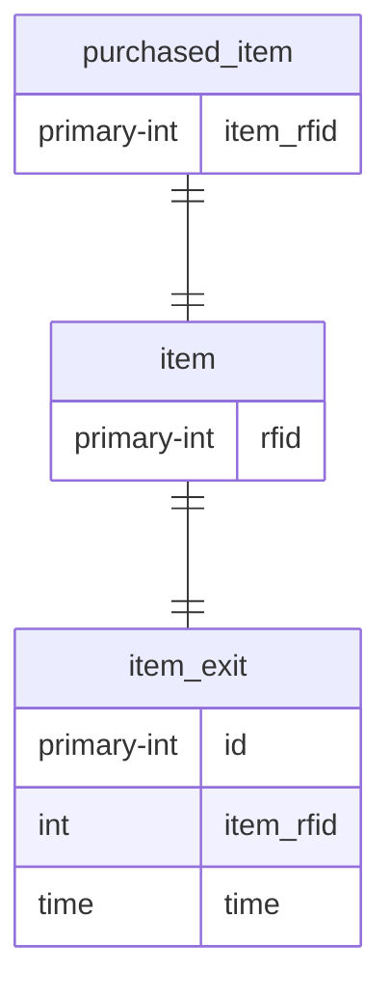

# (Đại học Sài Gòn - Seminar Chuyên Đề) RFID Guard

## Đề tài: Đề tài 8 (Retail - Security)

- Hàng đã thanh toán được đánh dấu là `Đã thanh toán`
- Khi hàng đi qua tổng RFID sẽ được ghi lại, nếu chưa thanh toán sẽ báo động
- Xuất báo cáo hàng ra
- _Lưu ý:_ bỏ qua trường hợp khách gian tháo tag ra

## Phát triển

### ERD

